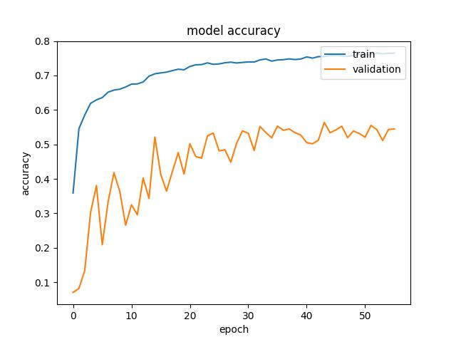
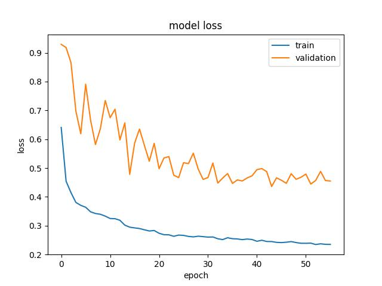
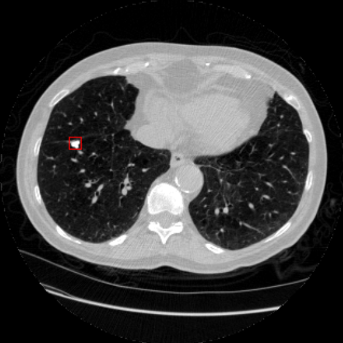
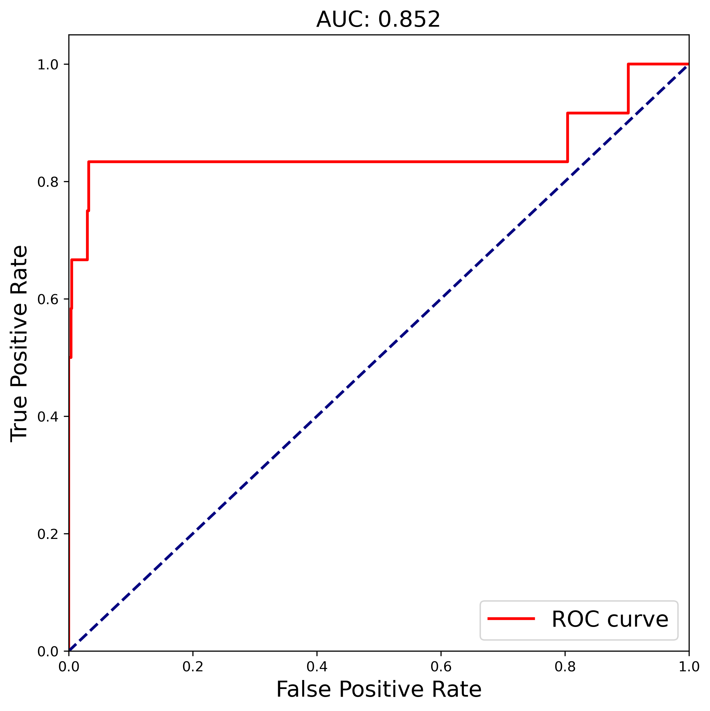
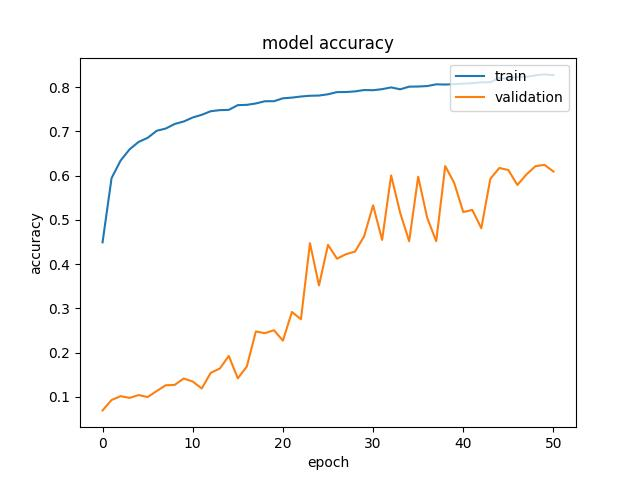
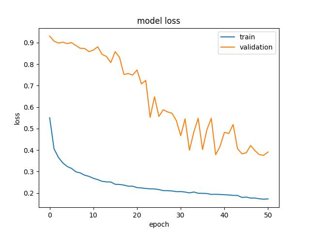
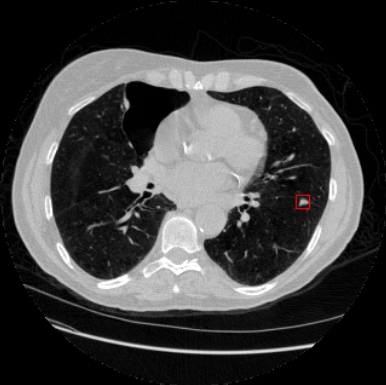
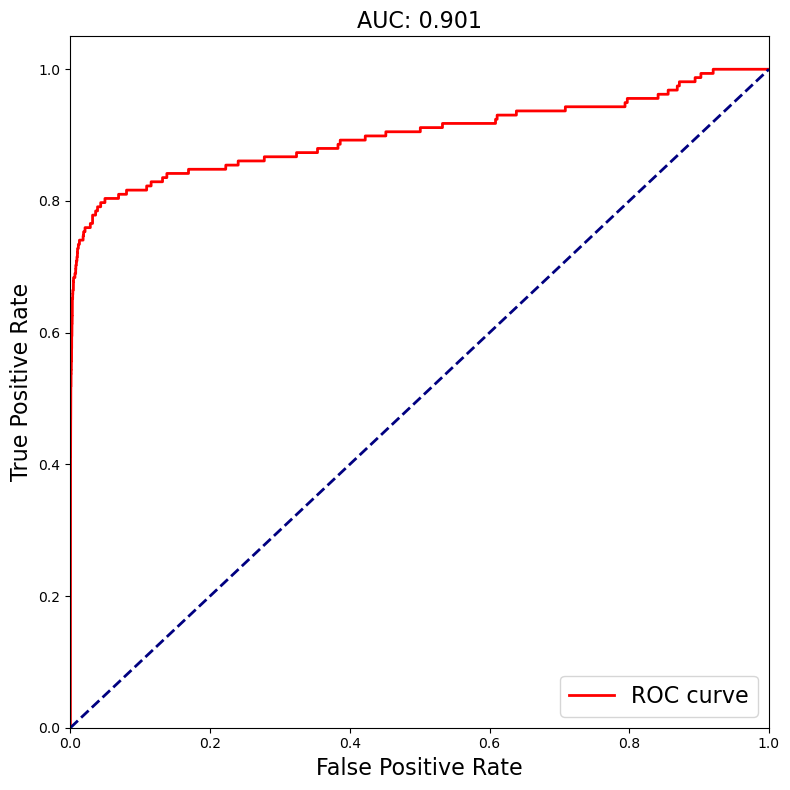

# Lung Nodule Detection (Undergraduate project)
Using **U-Net / U-Net++** for candidate extraction and a **3D MGI-CNN** for false-positive reduction to accomplish pulmonary nodule detection. This is my undergraduate research program.

# Content
A two-stage pulmonary nodule detection pipeline is established on deep convolutional neural networks:  
(1) a U-shaped network (**U-Net** and **U-Net++**) is used for **candidate nodule extraction**;  
(2) a **multi-scale 3D convolutional neural network (MGI-CNN)** is used to **filter false positives**, retain true nodules, and improve specificity.  
**No positive-sample augmentation** (e.g., CT-GAN) is used in this repository.  

**Specifically, it includes two part codes corresponding to the two folders.**

# How to start
## Software
python 3.6, CUDA 10.0, cudnn 7.6.5, **Keras 2.2.5**, **tensorflow-gpu 1.14.0**, scipy 1.4.1, Pillow 7.0.0, SimpleITK 1.2.4, opencv-python 4.2.0.32, pydicom,  
**PyTorch** (for 3D MGI-CNN).

## Usage
Detailed description is in each section folder. You can test **U-Net / U-Net++** (segmentation) and **MGI-CNN** (false-positive reduction) **separately**, and finally integrate them to complete the whole process of pulmonary nodule detection.

## Dataset
LIDC's subset: **LUNA16 dataset**.  
Default split in this repo: **train/val on `subset0–2`**, **test on `subset3`**.

# Notes
Due to hardware limitations, I mainly use a **small subset (subset0–2 for training/validation; subset3 for testing)**, so the overall performance is constrained and slight overfitting may appear. The FP-reduction stage is implemented to be **memory-friendly** (streaming patches, only loading existing local patients).

# Results

    
   Figure 1. U-Net model accuracy (train / validation)

 

    
   Figure 2. U-Net model loss (train / validation)

 

    
   Figure 3. U-Net qualitative example (red box = detected nodule)

 

    
   Figure 4. U-Net stage ROC (AUC shown in title)

 

    
   Figure 5. U-Net++ model accuracy (train / validation)

 

    
   Figure 6. U-Net++ model loss (train / validation)

 

    
   Figure 7. U-Net++ qualitative example (red box = detected nodule)

 

    
   Figure 8. U-Net++ stage ROC (AUC shown in title)

 

# Reference
[1] Ronneberger O., Fischer P., Brox T. **U-Net: Convolutional Networks for Biomedical Image Segmentation**. 2015. 
[2] Kim B. C., Yoon J. S., Choi J. S., et al. **Multi-scale Gradual Integration CNN for false positive reduction in pulmonary nodule detection**. *Neural Networks*, 2019, 115:1–10. 
